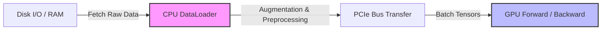

# CPU & GPU Bottlenecks

In deep learning, achieving high training throughput requires keeping the GPU continuously saturated with compute. However, severe hardware bottlenecks often occur when the CPU data pipeline cannot prepare and feed data fast enough to keep up with GPU execution speed.



---

## 1. Transfer Overhead & Batching

The GPU excels at parallel arithmetic, but transferring data across the PCIe bus from host memory (RAM) to GPU memory (VRAM) carries latency overhead.

* **Incorrect Approach (`__getitem__`)**: Moving individual samples to the GPU inside `Dataset.__getitem__` sends dozens of tiny payloads across the PCIe bus sequentially, incurring massive driver overhead per item.
* **Correct Approach (DataLoader Batching)**: The `DataLoader` stitches samples together on the CPU into a single batch tensor (e.g., `(32, 3, 224, 224)`), allowing one high-throughput bulk transfer over PCIe.

### Code Example: Efficient Host-to-Device Transfer

```python
import torch
from torch.utils.data import DataLoader, TensorDataset

# 1. Enable pinned memory on DataLoader (fast host-to-device transfers)
loader = DataLoader(
    dataset=dataset,
    batch_size=64,
    shuffle=True,
    num_workers=4,
    pin_memory=True,          # Allocates batch in page-locked (pinned) RAM
    persistent_workers=True,   # Keeps worker processes alive between epochs
    prefetch_factor=2         # Pre-fetches 2 batches per worker
)

# 2. Transfer non-blocking to GPU inside the training loop
for x_batch, y_batch in loader:
    # Asynchronous non-blocking transfer to GPU memory
    x_batch = x_batch.to('cuda', non_blocking=True)
    y_batch = y_batch.to('cuda', non_blocking=True)
    
    # Forward pass
    outputs = model(x_batch)
```

---

## 2. Profiling Performance Bottlenecks

When training is slow, you must identify whether performance is constrained by **CPU data preparation** or **GPU compute speed**.

### Profiler Tools

1. **PyTorch Profiler (`torch.profiler`)**: Native API to capture CPU and CUDA kernel execution timelines, memory allocation, and call stacks.
2. **TensorBoard Profiler Plugin**: Visualizes PyTorch profiler traces, displaying step time breakdowns, GPU utilization, and DataLoader bottlenecks.

### Using PyTorch Profiler

```python
import torch

with torch.profiler.profile(
    activities=[
        torch.profiler.ProfilerActivity.CPU,
        torch.profiler.ProfilerActivity.CUDA,
    ],
    schedule=torch.profiler.schedule(wait=1, warmup=1, active=3, repeat=1),
    on_trace_ready=torch.profiler.tensorboard_trace_handler('./log/profiler'),
    record_shapes=True,
    with_stack=True
) as prof:
    for step, (x, y) in enumerate(loader):
        x, y = x.to('cuda', non_blocking=True), y.to('cuda', non_blocking=True)
        optimizer.zero_grad()
        out = model(x)
        loss = criterion(out, y)
        loss.backward()
        optimizer.step()
        
        prof.step()  # Signal step completion to profiler
```

---

## 3. Diagnosing CPU vs. GPU Idle Time

| Symptom / Trace Finding | Root Cause | Solution |
| :--- | :--- | :--- |
| **GPU is idle (70%+ waiting for CPU)** | DataLoader bottleneck: Heavy CPU data augmentation or slow disk read. | Increase `num_workers`, use `pin_memory=True`, or move image transforms to GPU (e.g. `Kornia` / `torchvision.transforms.v2`). |
| **High PCIe Transfer Time (`memcpyHtoD`)** | Unpinned host memory or transferring unbatched items. | Enable `pin_memory=True` in DataLoader and use `non_blocking=True` on `.to(device)`. |
| **GPU Busy (95%+ utilization, long kernels)** | Model compute bound or batch size too large. | Optimize architecture, use Mixed Precision (`torch.cuda.amp.autocast`), or use FlashAttention. |
| **DataLoader Worker Churn / Latency Spikes** | Worker processes repeatedly created and destroyed per epoch. | Set `persistent_workers=True` in PyTorch `DataLoader`. |

---

## 4. Remediation Strategies for Data Bottlenecks

1. **Offload Preprocessing to GPU**: Move operations like normalization, resizing, or random crops from CPU `__getitem__` to GPU tensor transformations inside the training loop.
2. **Use Cached / In-Memory Data Loading**: For datasets fitting in RAM, load raw arrays into shared RAM (`torch.multiprocessing`) or fast NVMe SSD storage to minimize disk I/O latency.
3. **Use Automatic Mixed Precision (AMP)**: Reduces tensor memory footprint and bandwidth demands:
   ```python
   scaler = torch.cuda.amp.GradScaler()
   with torch.cuda.amp.autocast():
       output = model(x_batch)
       loss = criterion(output, y_batch)
   scaler.scale(loss).backward()
   scaler.step(optimizer)
   scaler.update()
   ```
