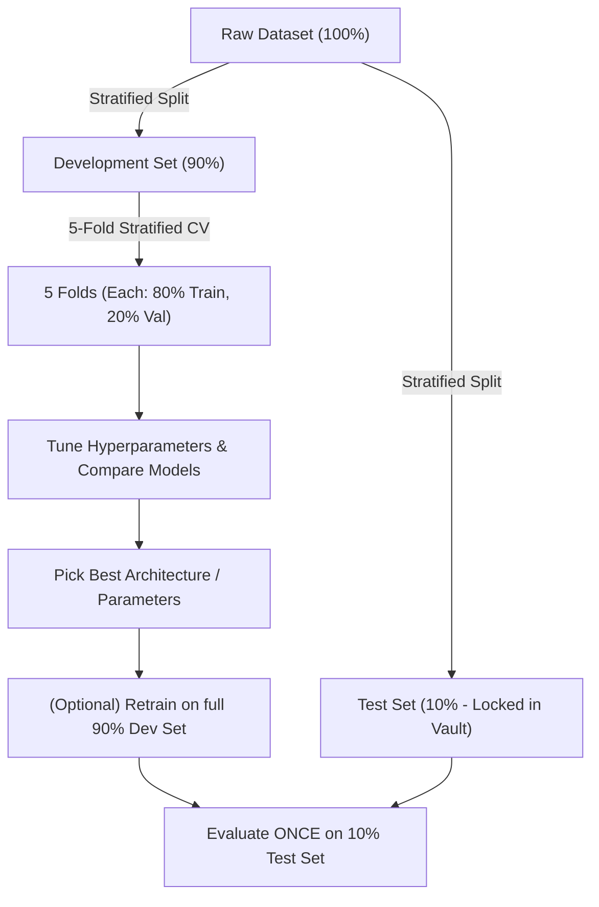

# Data Splitting

## But Why Split Data?

Could we not just train on all available data? No, without a sperate "valid/test" set, we could never measure performance on unseen samples, leading to overfitting. 

By splitting we are able to **NOT overfit**, overfit-underfit check `train vs val`, check real world data `test`, tune hyperparameters based on `val` etc.

## What is Stratification?

Stratified sampling ensures every split (train, val, test, or fold) preserves the original class distribution, so minority classes are never underrepresented or missing in evaluation subsets.

## Types of Data Split

### 1. (Stratified) Holdout Split

A single static partition:
- **Train (~70–80%)**: Fit model parameters (weights).
- **Validation (~10–20%)**: Tune hyperparameters, trigger early stopping.
- **Test (~10–20%)**: Held out strictly for final evaluation.

> **When to use**: Massive datasets (deep learning, LLMs) where training multiple folds is computationally prohibitive.

### 2. Stratified K-Fold Cross-Validation

The data is split into $K$ equal-sized folds while **strictly preserving the target class ratio** [Stratification] in every fold. And, the $K$ value **directly dictates the train/validation ratio**:

- **5-Fold**: automatically **80% train / 20% validation** per iteration.

- **10-Fold**: automatically **90% train / 10% validation** per iteration.


```
Total Dev Data (Preserved Class Distribution: e.g. 80% Class A, 20% Class B)
-------------------------------------------------------------------------
Fold 1:  [ VAL (20%) ] [  TRAIN (80%)  ] [  TRAIN (80%)  ] [  TRAIN (80%)  ] [  TRAIN (80%)  ]
Fold 2:  [ TRAIN     ] [  VAL          ] [  TRAIN        ] [  TRAIN        ] [  TRAIN        ]
Fold 3:  [ TRAIN     ] [  TRAIN        ] [  VAL          ] [  TRAIN        ] [  TRAIN        ]
Fold 4:  [ TRAIN     ] [  TRAIN        ] [  TRAIN        ] [  VAL          ] [  TRAIN        ]
Fold 5:  [ TRAIN     ] [  TRAIN        ] [  TRAIN        ] [  TRAIN        ] [  VAL          ]
```

#### Why Stratified over Regular K-Fold?
- **Prevents Distribution Shift**: Random folds can contain few or zero minority-class samples in imbalanced datasets.
- **Stable Metrics**: Every fold reflects the true real-world class distribution.
- **Lower Variance**: Yields more reliable performance estimates ($\text{Mean} \pm \text{Std}$).


## 3. Best Practice Workflow: Stratified Holdout + Stratified K-Fold


### The Standard Industry Pipeline



**Stage 1 — Carve out a Test Set (e.g., 10% or 15%)**:
   
- Stratified-sample a final test benchmark; do **not** touch or tune on it until the project is finished.

**Stage 2 — Stratified K-Fold on Remaining Data (e.g., 90%)**:
   
- Run 5-fold or 10-fold Stratified CV on the development set. For 5 folds, each iteration trains on 72% of total data (80% of 90%) and validates on 18% (20% of 90%).
   
- Select hyperparameters by mean CV score.

**Stage 3 — Final Generalization Check**:
   
- Evaluate the chosen model once on the untouched test set for an unbiased generalization score.
