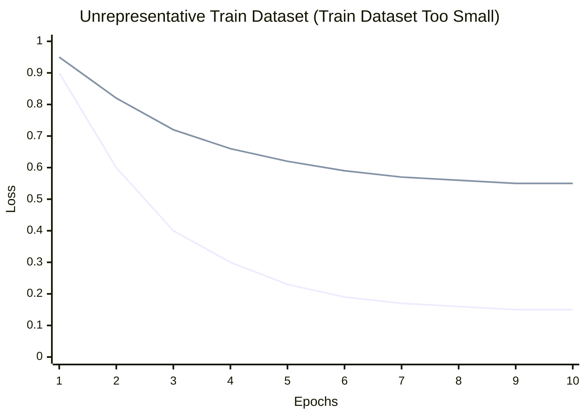
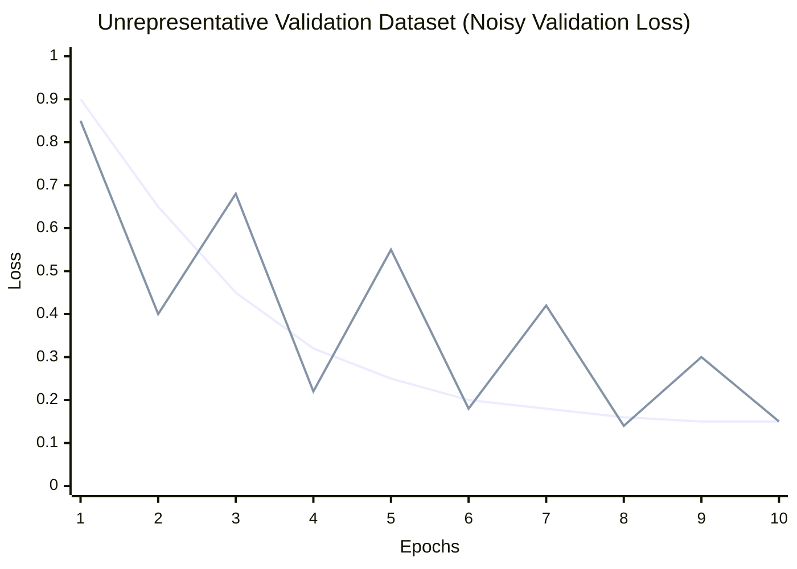
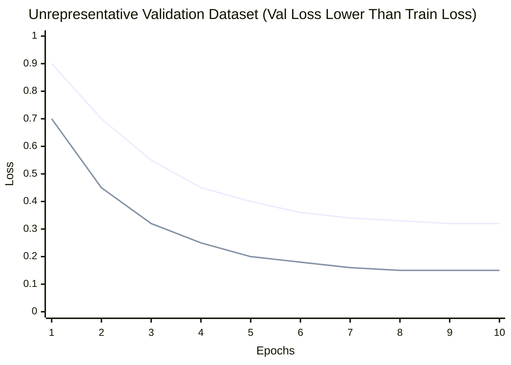

# Diagnosing Model Performance

## 1. The Sanity Check: Overfitting

The very first test: **Try to overfit a tiny subset of your data (e.g., a single batch of 4-8 examples).**

Turn off regularization (dropout, weight decay) and train for many epochs on just this single batch. 

Case 1: Model **cannot** achieve near 0 loss (or 100% accuracy) on a single batch even after a good number of epochs.
*Possible causes for failure:* Incorrect loss function, broken gradient flow, labels not matching inputs, or a severely flawed architecture.

Case 2: If your training and eval loss immediately drop to zero in the first epoch.
*Cause:* There is a data leak (e.g., your target variable is accidentally included in your features).   


## 2. Analyzing Optimization Learning Curves (Loss vs. Epochs)

**Learning Curve**: Training Loss and Validation Loss vs epochs. 

### Scenario A: Underfitting (High Bias)
**What it looks like:** Training loss is at an unacceptably high level. 

It additionally have: Instant Flatlining / Plateauing

Validation loss does not need to be checked detect underfitting. But it will stay high as well.

*   **Diagnosis 1: Not enough training time (Epochs).** 
    *   *Check:* Was the training loss still decreasing steadily when the training was stopped? 
    *   *Fix:* Train for more epochs.
*   **Diagnosis 2: Model capacity is too low.**
    *   *Check:* "Training accuracy" is not going higher than a certain *Medium* value while "Train Loss" stays relatively high. 
    *   *Fix:* You need a more powerful model. Increase the number of layers, hidden units, or switch to a more advanced architecture.
*   **Diagnosis 3: Over-regularization.**
    *   *Fix:* Reduce dropout, lower L1/L2 weight decay, or remove early stopping constraints.
*   **Diagnosis 4: Bad Data or Optimization Issues.**
    *   *Fix:* Check if your learning rate is too high (causing erratic jumps) or too low (stuck). Ensure your input features actually contain the information necessary to predict the target.

### Scenario B: Overfitting (High Variance)
**What it looks like:** Training loss continues to drop toward zero, but validation loss plateaus (and eventually starts increasing). A large gap exists between training and validation performance. The more the gap the more overfitting.

*   **Diagnosis 1: Lack of Data.**
    *   *Check:* The model performs great on training (e.g., 100% accuracy, 0 loss) but does poorly on validation data. This means it has not learned the underlying pattern and needs to see more variations of data.
    *   *Fix:* The model is memorizing the training set because it hasn't seen enough examples to generalize. You need more data (see Step 3 to confirm).
*   **Diagnosis 2: Model capacity is too high.**
    *   *Fix:* The model is too powerful for the amount of data you have. Reduce the size of the network.
*   **Diagnosis 3: Under-regularization.**
    *   *Fix:* Increase dropout, add weight decay, use data augmentation, or implement early stopping (stop training right before the validation loss starts rising).


- **Checking Convergence:** How do you know when to stop training? A final accuracy score won't tell you if training for 10 more epochs would have helped. A graph showing the loss flattening out (asymptoting) confirms the model has converged.


### Senario C: Exploding Gradient
**Symptom**: Large spikes in Loss curve

**Possible causes**: 
1. Learning rate is too high: The model takes steps that are too large. At some point, as it gets closer to the narrow bottom of the valley, a single step overshoot takes it completely across the valley, landing it way up on the opposite wall. This can happen due to outliers as well.

**Fixes**:
1. Lower the Learning Rate
2. Add Gradient Clipping

### Senario D: Vanishing Gradient
**Symptom**: Stalled Learning (a flat loss curve that stays high and refuses to go down from the very beginning).

**Possible Causes**:
1. Initial Learning Rate is too low:
If your initial learning rate is too small, the model may barely move from its initial weights. The loss will remain almost flat, looking very similar to the vanishing gradient problem.

2. Vanishing Gradients (Deep Networks):
In very deep networks (especially those with many layers), the gradients calculated during backpropagation become exponentially smaller as they move backward from the output layer to the input layer.

**Fixes**:
1. Increase the Initial Learning Rate
2. Change Activation Functions: Use ReLU or its variants (Leaky ReLU, PReLU) instead of Sigmoid or Tanh.
3. Use Proper Weight Initialization: Techniques like Xavier/Glorot or He initialization help maintain variance.
4. Use Residual Connections: Architectures like ResNet help gradients flow through the network.
5. Use Batch Normalization


## 3. How to Know if You Need MORE DATA

**The Solution: Plot Error vs. Training Set Size**

Train your model multiple times, using increasingly larger subsets of your existing training data (e.g., 20%, 40%, 60%, 80%, 100%), and plot the final training and validation errors for each run.

**If the validation curve is approaching the training curve but there is still a significant gap at 100% data:** 
Adding more data **WILL** likely improve performance. The model is currently overfitting, and more data will force it to generalize.

**If the training and validation curves have converged (or are very close) and are completely flat as you approach 100% data:** 
Adding more data **WILL NOT** help. Your model has reached its capacity limit. You have a High Bias problem and must increase model complexity or improve feature engineering.

## 4. Diagnosing Unrepresentative Datasets

An **unrepresentative dataset** is a dataset that does not capture the full (statistical) characteristics compared to another dataset drawn from the same domain (such as between a train and a validation dataset). This commonly occurs if the number of samples in a dataset is too small relative to another dataset.

---

### Scenario A: Unrepresentative Train Dataset

The training dataset does not provide sufficient information to learn the problem relative to the validation dataset used to evaluate it.

* **Cause:** Training dataset has too few examples compared to the validation dataset.
* **Symptom:** The learning curve for training loss shows improvement and validation loss also shows improvement, but a **large gap remains** between both curves.



---

### Scenario B: Unrepresentative Validation Dataset

The validation dataset does not provide sufficient information to evaluate the ability of the model to generalize.

#### Case 1: Noisy Validation Curve
* **Cause:** Validation dataset has too few examples compared to the training dataset.
* **Symptom:** Training loss curve looks like a good fit (or other fits), but validation loss shows **noisy, erratic movements** around the training loss curve.



#### Case 2: Validation Loss Lower than Training Loss
* **Cause:** The validation dataset is easier for the model to predict than the training dataset (e.g., validation set is too small or contains less complex examples).
* **Symptom:** Validation loss is **consistently lower** than the training loss throughout training.




## 5. Data & Model Quality Diagnostics

Modern ML pipelines require automated data and model quality checks beyond raw loss curves to catch subtle distribution shifts, corrupted labels, and feature leaks.

### Tooling Overview

| Diagnostic Area | Key Tools | Primary Purpose |
| :--- | :--- | :--- |
| **Data Drift & Distribution Shift** | **Evidently AI**, **Deepchecks** | Detect statistical divergence (KS-test, PSI, Wasserstein distance) between train and validation/production distributions. |
| **Label Noise Detection** | **Cleanlab** | Identify mislabeled training samples, ambiguous annotations, and label errors using confident learning. |
| **Data Leakage Audits** | **Deepchecks**, **Evidently AI** | Detect features that leak future or target information before model training. |

---

### A. Data Drift & Distribution Shifts
* **Symptom**: Model performs poorly on validation/test data despite low training loss and normal capacity.
* **Diagnosis**: Train and validation data distributions differ ($P(X_{\text{train}}) \neq P(X_{\text{val}})$).
* **Detection**:
  * **Deepchecks**: `TrainTestFeatureDrift` suite calculates drift metrics (Earth Mover's Distance, Kolmogorov-Smirnov test) per feature.
  * **Evidently AI**: `DataDriftPreset` outputs interactive reports flagging drifted features across data splits.

---

### B. Label Noise & Mislabeled Data
* **Symptom**: Training loss plateaus prematurely or model memorizes incorrect labels, causing poor generalization.
* **Diagnosis**: Ground-truth target annotations in the training set contain noise or human labeling errors.
* **Detection**:
  * **Cleanlab**: Uses out-of-fold predicted probabilities to find label issues with Confident Learning.
  ```python
  from cleanlab.filter import find_label_issues

  # Identify indices of likely mislabeled training data
  issue_indices = find_label_issues(
      labels=train_labels,
      pred_probs=out_of_fold_probs,
      return_indices_ranked_by='self_confidence'
  )
  ```

---

### C. Data Leakage
* **Symptom**: Validation accuracy is suspiciously perfect (e.g. 99.9%) or loss drops near zero on epoch 1.
* **Diagnosis**: Feature data directly or indirectly contains information about the target variable or future states.
* **Common Sources**:
  1. **Preprocessor Leakage**: Fitting feature scalers/encoders on the entire dataset prior to train/val splitting.
  2. **Temporal Leakage**: Splitting time-series data randomly instead of chronologically.
  3. **Direct Feature Leakage**: Including target proxy variables in feature matrices.
* **Detection**:
  * **Deepchecks**: `DataLeakage` check measures single-feature predictive power against target variables prior to modeling.


## 6. Summary Diagnostic Checklist


| Observation | Primary Diagnosis | Recommended Actions |
| :--- | :--- | :--- |
| **Can't overfit a single batch** | Pipeline Bug | Check data loader, loss function, gradients, labels. |
| **Train loss decreasing, Val loss decreasing** | Still Learning | Keep training! Increase epochs. |
| **Train loss high, Val loss high (Flat)** | Underfitting (High Bias) | Increase model size, decrease regularization, check learning rate. |
| **Train loss low, Val loss high (Gap)** | Overfitting (High Variance) | Get more data, use data augmentation, increase regularization, add early stopping, reduce model size. |
| **Both curves flat across dataset sizes** | Capacity Limit Reached | More data won't help. Use a more powerful model architecture. |
| **Train & Val improving, but persistent large gap** | Unrepresentative Train Dataset | Increase training dataset size relative to validation dataset. |
| **Val loss noisy/erratic around Train loss** | Unrepresentative Validation Dataset | Increase validation dataset size for a more reliable generalization metric. |
| **Val loss consistently lower than Train loss** | Validation Dataset Too Easy | Re-evaluate dataset split; check for data leaks or biased validation sampling. |
| **Loss drops to near zero in Epoch 1** | Data Leakage | Audit features with Deepchecks/Evidently AI for target correlation; fit scalers only on training split. |
| **Train vs Val distributions diverge** | Data Drift | Run Deepchecks `TrainTestFeatureDrift` / Evidently AI to isolate shifted features; collect domain data. |
| **High training loss with high model capacity** | Label Noise | Use Cleanlab (`find_label_issues`) to locate and clean mislabeled training samples. |

