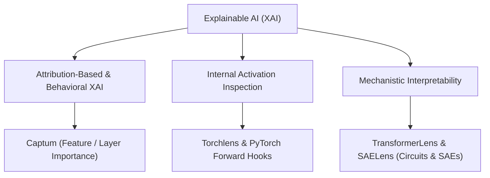

# XAI: Explainable AI

Explainable AI is a set of tools and systems that try to explain how and why AI model predict what they predict.




1. **Attribution-Based & Behavioral XAI**: Measures how input features or internal layers score in contributing to a specific output. Answers *"what was important?"*
2. **Internal Activation & Graph Inspection**: Inspects tensor flow, feature maps, and intermediate hidden states during execution. Answers *"what is flowing inside?"*
3. **Mechanistic Interpretability**: Reverse-engineers neural networks into human-understandable circuits and algorithms embedded in weights. Answers *"If a model is thought of as a system, which weight group relate to which features (an specific computation i.e. finding straight lines), and how thoses features form circuit (communicate with each other)"*

---

## Practical Tooling & Decision Guide

### Use **Captum** (Attribution-Based XAI)
**For answering:**

**Which input features caused this prediction?** (Using `IntegratedGradients`, `Saliency`, or `DeepLIFT` to highlight audio samples, image pixels, or text tokens driving the model's output).

**Which structural layers contributed most to the output?** (Using `LayerConductance` to evaluate if earlier Conv layers or later GRU/Dense layers did the heavy lifting).

**Which specific neurons are firing for a given class?** (Using `NeuronAttribution` / `NeuronConductance`).

**Does the model rely on human-understandable concepts?** (Using `TCAV` - Testing with Concept Activation Vectors).

**How robust is the attribution score against noise?** (Using `NoiseTunnel` or `FeatureAblation`).

[Opening Up the Black Box: Model Understanding with Captum and PyTorch](https://www.youtube.com/watch?v=0QLrRyLndFI)

---

### Use **Torchlens** (Computational Graph & Tensor Flow Inspection)
**For answering:**
* **What is the exact computational graph of my model?** (Automatically visualizes DAGs without manual code edits).
* **What are the shapes and values of all intermediate tensors?** (Logs every hidden tensor across complex skip connections and multi-branch architectures).
* **Where are tensor shape mismatches or unexpected transformations occurring?**

---

### Use **PyTorch Native Forward Hooks** (`register_forward_hook`)
**For answering:**
* **What do intermediate CNN feature maps look like during inference?**
* **How do GRU/LSTM hidden state vectors ($h_t$) evolve across sequential time steps?**
* **What are the raw attention matrices ($\mathbf{Q}\mathbf{K}^T$) inside attention blocks?**
* **How can I extract internal activations without adding third-party library dependencies?**

```python
activations = {}
def get_activation(name):
    def hook(model, input, output):
        activations[name] = output.detach()
    return hook

# Example: Hooking into a GRU or Conv layer
model.gru.register_forward_hook(get_activation('gru_layer'))
```

---

### Use **TransformerLens & SAELens** (Mechanistic Interpretability for LLMs / Transformers)
**For answering:**
* **Which specific attention heads implement specific behaviors?** (e.g., identifying Induction Heads, Duplicate Token Heads, or Indirect Object Identifier heads).
* **What happens when you swap or patch intermediate activations across prompts?** (Using **Activation Patching / Causal Tracing**).
* **How do we disentangle polysemantic neurons into clean concepts?** (Using **Sparse Autoencoders / SAEs** with SAELens).

---

### Use **TensorBoard / W&B / PyTorch Profiler** (Training Health & Performance Diagnostics)
**For answering:**
* **Is the model suffering from vanishing or exploding gradients?** (Monitoring layer-by-layer gradient norms $\| \nabla w \|$).
* **Are there dead neurons or inactive ReLU units?** (Tracking activation distribution histograms).
* **Which layer creates a GPU compute or memory bottleneck?** (Using `torch.profiler`).

---

## Tool Selection Matrix

| Question / Use Case | Recommended Tool | Core Method / Function |
| :--- | :--- | :--- |
| **Input Feature Heatmaps** | Captum | `IntegratedGradients` / `Saliency` |
| **Layer-Level Contribution** | Captum | `LayerConductance` |
| **Concept-Level Testing** | Captum | `TCAV` |
| **Automatic Graph & Activation Logging** | Torchlens | `torchlens.show_model_log()` |
| **Custom Hidden State / Attention Extraction** | PyTorch Hooks | `model.layer.register_forward_hook()` |
| **Circuit & Activation Patching (LLMs)** | TransformerLens | `transformer_lens.HookedTransformer` |
| **Monosemantic Concept Discovery** | SAELens | Sparse Autoencoders (SAEs) |
| **Gradient Flow & Dead Neuron Debugging** | TensorBoard / W&B | Layer Gradient Norms & Histograms |
| **Compute & Bottleneck Profiling** | PyTorch Profiler | `torch.profiler.profile()` |
